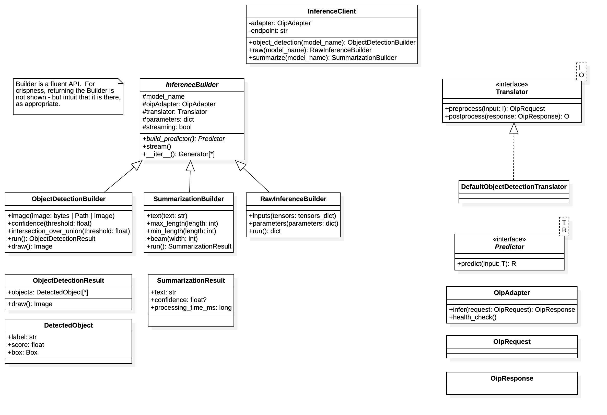
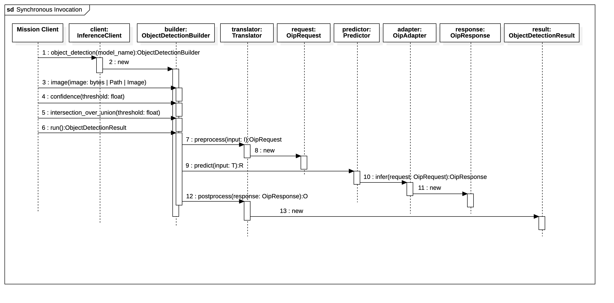
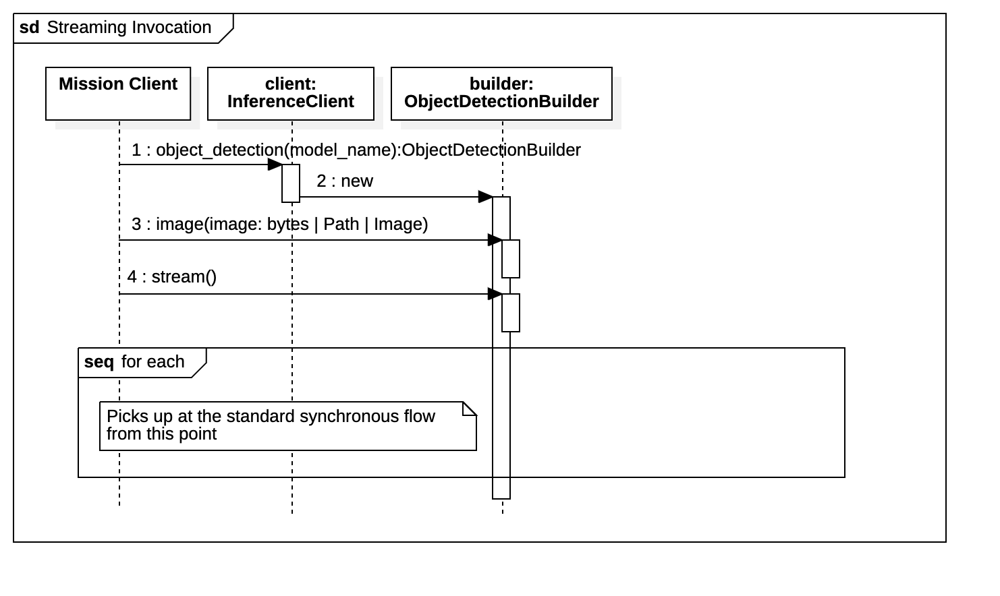

# Client Design
The following diagram is NOT a living document; it represents a point in time look at how the OIP client was initially
conceived.  

## Class Diagram

### Classes

#### InferenceClient
A facade of the entire client library. Supports one-line construction with zero configuration ceremony. It wraps the 
`OIPAdapter` that controls invocation of OIP-compliant endpoints.

ALL task-specific entry points (e.g., `detect_object`, `summarize`) are accessible from here.

#### InferenceBuilder
Rather than supporting a generic `predict` method, this abstract class allows tasks to be defined in a more natural, 
task-specific fashion where each task has defined functionality and the opportunity for compile-time safety. In addition
to containing shared state, it also supports a common location from which to access functions for a specific functional
type of inference (e.g., `detect_object`, `summarize` - basically akin to a HuggingFace model "task").

#### ObjectDetectionBuilder
A task-specific implementation with specific, concrete binding to appropriate context for object detection. This creates
an easy-to-understand task interface pattern that is devoid of ML jargon: `detect_object().image(...).run()`.

Consider this a placeholder for any other concrete task (e.g., `summarize`, `classify_text`).

#### RawInferenceBuilder
A "minimal interface" for those rare instances where you need to send in raw tensors. It's ugly and non-fluent so it 
is not used "by accident". If using this, you probably should be adding a new abstraction for an appropriate task, even
if it is custom to your project.

#### Translator
Directly inspired by DJL, this is the ONLY class that knows about the OIP json schema, tensor shapes, inputs,
parameters, framing, etc.  It is intended to be pluggable and testable in isolation.  It also provides tolerable
reader behavior, where unknown fields can be ignored. 

#### DefaultObjectDetectionTranslator
A reasonable default for object detection payloads that can auto-encode images, etc. If you need to add custom behavior,
you should extend this (or similar) classes.

#### Predictor
Inspired by DJL, this represents a ready to invoke inference function as a wrapper around a specific model endpoint. It 
handles resources (e.g., connection pools, retries, timeouts). One instance exists for each wrapper, keeping fluent 
references to a model efficient.

#### StreamPredictor
A specialized `Predictor` that supports streaming responses (e.g., gRPC, chunked HTTP). Implements Python's iterator
protocol so it can support `for part in predictor:` syntax. Isolates streaming details from the builder's surface area.

#### OipAdapter
This is the sole class that interacts with OIP endpoints.  It is stateless and can be mocked for client testing.
Implements appropriate backoff, authentication, and metrics capturing.

#### SummarizationResult
Value object representing the result of a summarization inference.

#### ObjectDetectionResult
Value object representing the result of an object detection inference.  Includes a convenience method to draw the
results on the image.

## Sequence Diagrams
The following diagrams capture the coarse-grained flow of invoking OIP services.

### Synchronous Invocation
The following diagram covers invoking an object determine example via a single, synchronous API.

### Streaming Invocation
The following diagram covers invoking an object determine example via a single, synchronous API using a streaming 
approach.

## Other Considerations
We will likely want to also support batch, asynchronous processing, and how to perform pre-processing steps ahead of 
inferences like object detection (for example). We will iterate over those concepts after validate these core concepts
first.